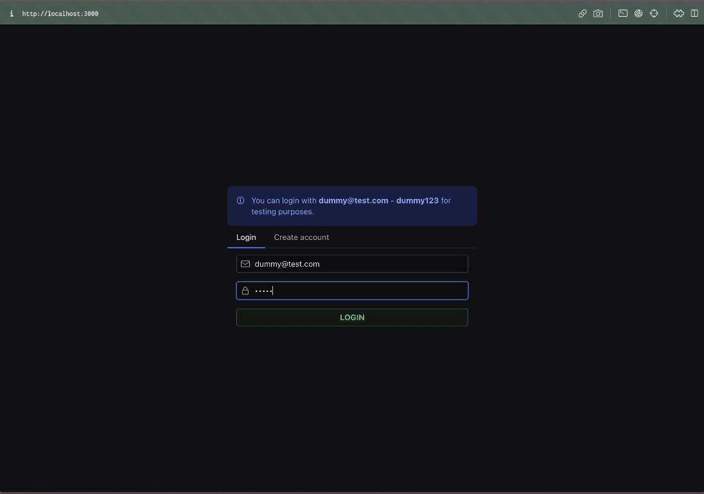
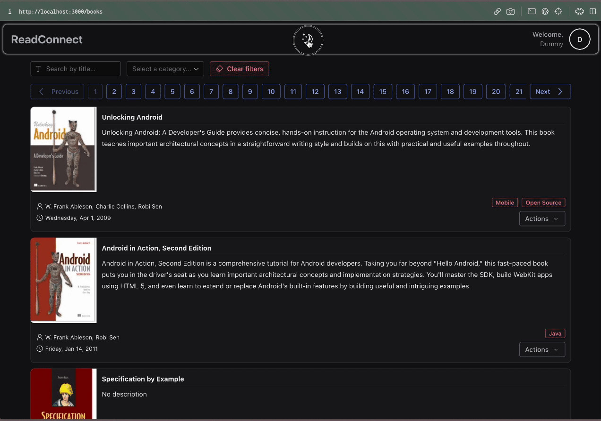
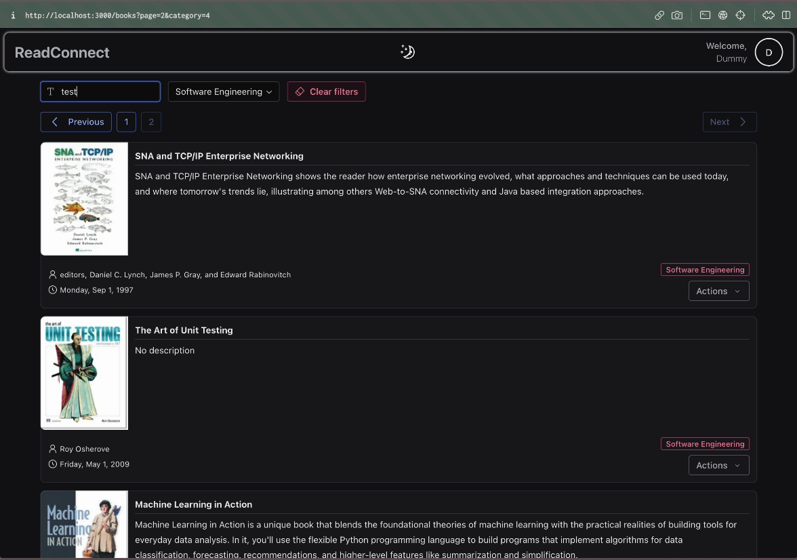

# ReadConnect

Proyecto realizado con:
[](https://skillicons.dev)

## Primeros pasos

### Base de datos

1. Crear base de datos en PostgreSQL
2. Crear archivo .env en ./apps/backend, con información asociada a la base de datos creada: nombre de usuario, contraseña, nombre de base de datos y puerto, siguiendo la estructura mostrada en el archivo .env.example

### Backend

1. Completar archivo .env con SECRET (cualquier cadena de caracteres) y HOST (localhost para modo development)
2. Iniciar servidor en modo development

```bash
npm run dev
# or
yarn dev
# or
pnpm dev
# or
bun dev
```

### Frontend

Iniciar cliente en modo development

```bash
npm run dev
# or
yarn dev
# or
pnpm dev
# or
bun dev
```

## Demo








